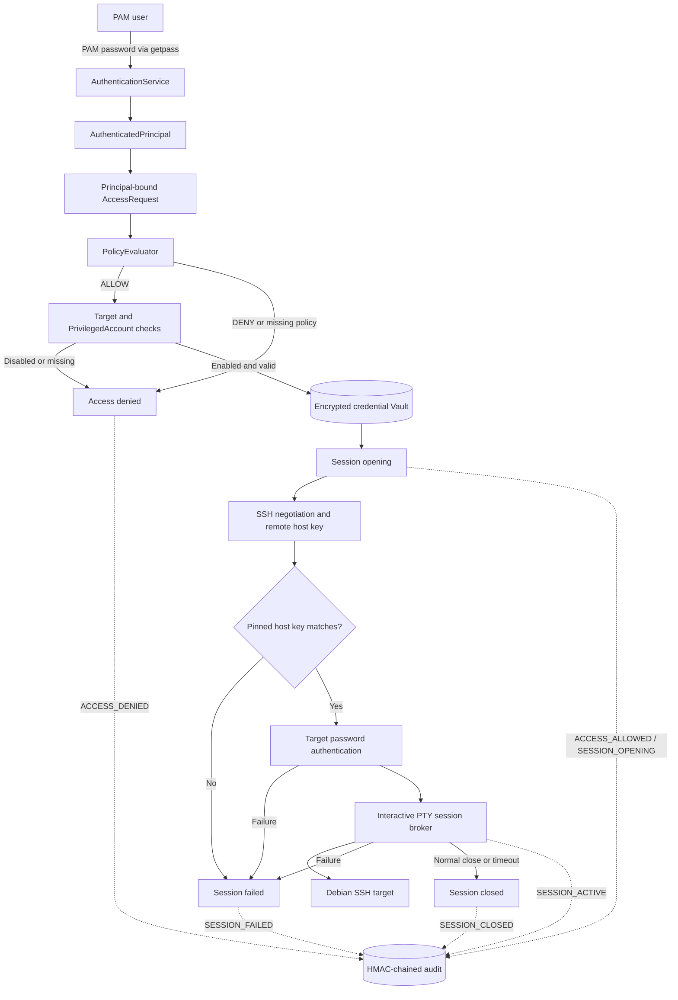

# PAM MVP

[](https://github.com/gksukesenn/pam-mvp/actions/workflows/ci.yml)
[](pyproject.toml)
[](#scope)

A security-focused Privileged Access Management reference MVP that brokers an
interactive privileged SSH session without exposing the target-account
password to the operator.

It combines fail-closed authorization, AES-256-GCM credential storage, pinned
SSH server identity, an interactive PTY broker, bounded session lifetime,
HMAC-chained audit, and Clean Architecture in one reviewable trust path.

## Validation evidence

- **381 automated tests** covering domain, adapter, composition, and security
  boundaries
- **86.02% measured statement-plus-branch coverage**, with an enforced 84% CI
  floor
- **Real Debian 13 E2E:** PAM authentication through a brokered privileged SSH
  shell
- **Live negative validation:** denial, disabled configuration, bad host pin,
  wrong credentials, timeout, and audit tampering
- **GitHub Actions:** green on Python 3.11 and 3.14
- **Release gates:** Ruff, mypy, dependency audit, and tracked-file secret scan

Test count alone is not treated as proof of security; the evidence combines
behavioral tests, real adapters, manual boundary validation, and explicit
limitations. See [Live Validation](docs/LIVE_VALIDATION.md) and the
[Final Release Audit](docs/FINAL_RELEASE_AUDIT.md).

## Why this project

A PAM user should be able to request a privileged shell without knowing or
typing the managed target's privileged-account password. This MVP
authenticates the local PAM user, binds authorization to that authenticated
identity, resolves the target credential from an encrypted Vault, verifies the
SSH server's pinned identity, and only then uses the credential to authenticate
and broker the interactive session.

That ordering is the security argument: denial and disabled configuration stop
before Vault or SSH access, while a wrong server key stops before target
password authentication. `AccessService` owns that use-case sequence and emits
only the implemented access/session lifecycle audit events.

## What it demonstrates

- Clean Architecture and dependency inversion across domain, ports, adapters,
  and composition
- Authenticated identity binding that removes caller-controlled authorization
  identity
- Fail-closed ordering across policy, target, account, Vault, and broker
- Authenticated encryption for target credentials at rest
- SSH server identity verification before target credential use
- State-machine-based session lifecycle and deterministic terminal outcomes
- Monotonic maximum-duration enforcement independent of wall-clock movement
- HMAC-chained tamper-evident audit with documented assurance boundaries
- Negative security testing backed by real SQLite/crypto adapters behind ports
- CI across Python 3.11 and 3.14 with lint, type, coverage, dependency, and
  tracked-file secret gates

## Architecture



The CLI never accepts a caller-supplied `user_id`. After authentication it
uses the principal's `user_id` in the access request, and `AccessService`
rejects an identity mismatch before policy, Vault, or SSH work. Audit begins
with access/session processing; the MVP does not claim pre-authentication audit
events.

## Live demo

This sanitized transcript reflects the completed manual Debian 13 validation.
The PAM password is entered at a non-echoing prompt; no target password prompt
appears and no terminal transcript is stored by the application.

**The target privileged-account password is retrieved from the encrypted Vault
and is never entered by the operator during access.** It necessarily exists
briefly in process and SSH-library memory; Python does not guarantee
deterministic zeroization.

```text
$ python -m src.main access \
    --runtime-dir ./runtime/lab \
    --username goksu \
    --target-id target-001

PAM password:
Authenticated. Requesting access to target-001...

pamadmin@linux-server-1:~$ whoami
pamadmin

pamadmin@linux-server-1:~$ hostname
linux-server-1

pamadmin@linux-server-1:~$ exit
Session closed.
```

The successful run and negative matrix are recorded in
[Live Validation](docs/LIVE_VALIDATION.md); they are environment-specific
manual evidence rather than CI tests.

## Scope

The supported product is a single-instance, local Linux command-line MVP. It
uses one local PAM user, direct user-to-target policy, one privileged account
per target, local SQLite persistence, and a separately managed Debian SSH
target. The lab is intentionally small enough for its security ordering to be
reviewed end to end.

## Security guarantees

Within the [documented threat model](docs/THREAT_MODEL.md), the implementation
and tests support these claims:

- PAM login passwords are persisted as salted Argon2id hashes, not plaintext.
- Target credentials are encrypted at rest with AES-256-GCM and a fresh
  96-bit random nonce for each encryption.
- The Vault database does not contain its encryption key. Vault and audit use
  distinct key paths and distinct key bytes.
- During access, the operator enters only the PAM login password. The target
  password is resolved from the encrypted Vault and is not displayed.
- Authorization is bound to `AuthenticatedPrincipal`. Missing policy and
  explicit `DENY` fail closed; `DENY` takes precedence over `ALLOW`.
- Disabled targets and privileged accounts stop before Vault or broker use.
- The configured SSH host key is compared before target-password
  authentication. There is no trust-on-first-use path, and the Paramiko
  adapter disables its legacy CBC/3DES ciphers, SHA-1/MD5 MACs, and
  `ssh-rsa`/SHA-1 host/public-key signature algorithm.
- Session state transitions are constrained, broker/channel cleanup is
  attempted on every path, and local terminal restoration is protected by a
  context manager.
- The maximum session duration is a total elapsed-time limit measured with a
  monotonic clock; activity does not reset it.
- Access and session lifecycle events are stored in an append-only application
  interface and linked with HMAC-SHA256 for tamper evidence.
- Provisioned/access runtime directories are required to be `0700`; key and
  SQLite files are `0600`. Key and DB leaf paths reject symbolic links and
  non-regular files.

The precise guarantee for the current lab is that **database-only theft or
accidental disclosure of `vault.db` does not reveal the target credential
without `vault.key`**. The lab stores keys and databases as separate files in
the same owner-only runtime directory.

## Explicit non-guarantees

This MVP does not claim to protect secrets after compromise of the PAM host,
the PAM OS account, the running process, or root. Copying the entire runtime
directory captures both encrypted data and local file keys.

Passwords exist briefly in process memory, and Python cannot guarantee
deterministic memory zeroization. The local audit chain is tamper-evident, not
tamper-proof: valid tail truncation cannot be detected without an externally
trusted chain-head anchor, and compromise of the local audit key permits chain
recomputation.

Sessions are not recorded and commands are not filtered. The MVP has no MFA,
RBAC/ABAC, JIT grant, approval engine, brute-force lockout/rate limiting,
credential rotation, key rotation, external identity provider, SSH
certificate support, remote SIEM/WORM storage, or high-availability
deployment. See [Known Limitations](docs/KNOWN_LIMITATIONS.md).

## Quick start

The commands must be run from the repository root on Linux.

The supported interpreter range is **Python 3.11 through 3.14**
(`>=3.11,<3.15`). The interactive terminal implementation requires a
Linux/POSIX terminal. Some domain and adapter tests may run elsewhere, but
the product CLI does not claim Windows support. Docker is not required.

1. Build the host and Debian target by following
   [Lab Setup](docs/LAB_SETUP.md). It includes portable target-IP and host-key
   configuration; do not assume the tested example values match another VM.
2. Provision a fresh ignored runtime with the interactive provisioning command
   in that guide. Passwords are read with `getpass`, never command-line flags.
3. Run the [successful access procedure](docs/LAB_E2E.md).
4. Optionally run the isolated [negative-security procedure](docs/LAB_NEGATIVE_E2E.md).

The access command has this shape:

```bash
python -m src.main access \
    --runtime-dir ./runtime/lab \
    --username goksu \
    --target-id target-001
```

## Tests

The automated suite uses fakes at the final network boundary; it does not
connect to the Debian VM.

For a runtime-only editable installation:

```bash
python3 -m venv .venv
. .venv/bin/activate
python -m pip install --upgrade pip==26.2.1
python -m pip install -r requirements.txt
```

For development, install the separately pinned tool set instead; it includes
the editable project and runtime dependencies:

```bash
python3 -m venv .venv
. .venv/bin/activate
python -m pip install --upgrade pip==26.2.1
python -m pip install -r requirements-dev.txt
```

Run the tests from the repository root:

```bash
pytest -q
```

The suite exercises domain invariants, fail-closed ordering, real SQLite and
crypto adapters, SSH host-key-before-authentication behavior, cleanup,
terminal restoration, provisioning, CLI result mapping, runtime permissions,
and audit integrity. Test volume alone is not treated as proof of security.
Manual environment-specific evidence is recorded in
[Live Validation](docs/LIVE_VALIDATION.md).

## Development checks

The authoritative project and tool configuration is in `pyproject.toml`.
Runtime dependencies are declared there and installed through
`requirements.txt`; pinned development tools are separated in
`requirements-dev.txt`.

```bash
# Import and correctness checks
python -m compileall -q src tests
python -m pip check

# E/F, import-order, pyupgrade, and Bugbear lint rules
ruff check src tests scripts

# Incremental type check of domain, application, and ports
mypy

# Statement and branch coverage; configured minimum is 84%
pytest -q --cov=src --cov-branch --cov-report=term-missing

# Point-in-time audits of declared runtime and installed development dependencies
pip-audit . --progress-spinner off
pip-audit --local --progress-spinner off

# detect-secrets scan of Git-tracked files; candidate values are withheld
python scripts/check_secrets.py
```

The measured Phase 10B-4 statement-plus-branch total is 86%. The 84% floor
prevents a material regression without encouraging low-value tests for every
defensive OS-error branch. A passing dependency audit means no vulnerability
known to that audit service at scan time; it is not a permanent guarantee.

GitHub Actions runs compile, lint, core-boundary typing, tests, and coverage on
Linux with Python 3.11 and 3.14. A separate Linux job performs dependency and
tracked-file secret audits. CI never starts libvirt, contacts the Debian lab,
or reads a local `runtime/` directory.

Licensing and redistribution terms remain pending repository-owner/employer
authorization. No software license is granted by this README.

## Documentation

- [Product Requirements](docs/PRD.md)
- [Threat Model and trust boundaries](docs/THREAT_MODEL.md)
- [Domain Model](docs/DOMAIN_MODEL.md)
- [Known Limitations](docs/KNOWN_LIMITATIONS.md)
- [Lab Setup](docs/LAB_SETUP.md)
- [Successful E2E Runbook](docs/LAB_E2E.md)
- [Negative E2E Runbook](docs/LAB_NEGATIVE_E2E.md)
- [Live Validation Record](docs/LIVE_VALIDATION.md)
- [Final Gap Audit](docs/FINAL_GAP_AUDIT.md)
- [Final Release Audit](docs/FINAL_RELEASE_AUDIT.md)
- [ADR-002: Vault and Master Key Strategy](docs/adr/ADR-002-vault-key-strategy.md)
- [ADR-003: Access Policy Model](docs/adr/ADR-003-access-policy.md)
- [ADR-004: Audit and Integrity Strategy](docs/adr/ADR-004-audit-integrity.md)
- [ADR-005: Target and Lab Strategy](docs/adr/ADR-005-target-lab-strategy.md)

The original DOCX ADR artifacts remain under `ADRS- PRD/` as historical
source material. The Markdown versions preserve their intent and identify
current implementation revisions explicitly.
